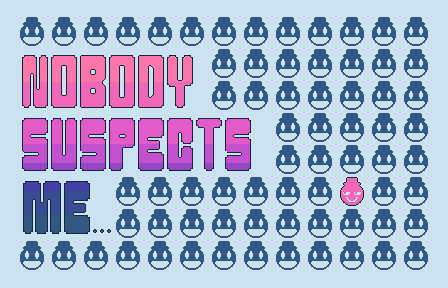

# Nobody Suspects Me

> Nobody suspected him. Why would they? After all, he looked just like everyone else. And thats exactly how... he got away with it.

### About
This is a maze/time-based game, made with the Love2D Game framework.

It was made for the [A Game By Its Cover](https://itch.io/jam/a-game-by-its-cover-2020) Game Jam
hosted on [itch.io](https://itch.io/).

The game is based on [this](http://famicase.com/18/softs/085.html) famicase cover.

You can view this year's catalog [here](https://famicase.com/20/index.html).

### Synopsis
Your name is Pink. You live in Pink-Town. You and your friends absolutely LOVE the color pink. In fact, you throw pink-themed parties almost every single night. Nibbling on pink-colored appetizers and sipping pink tea as you wiggle your pinky finger. (It's all rather absurd actually; myself hailing from Green-Town would never wiggle a finger while indulging in a cup of tea).

As tradition states, once every year one special resident of Pink-Town is selected to be given the title Blend-Master if they can successfully infiltrate a neighboring town unsuspected. You have been selected this year.

### Credits
- Music, Audio, & Font Assets - [KenneyNL](https://www.kenney.nl/)
- [H.U.M.P.](https://hump.readthedocs.io/en/latest/index.html) - (timer, gamestates, camera)
- [Simple Tiled Implementation](https://github.com/karai17/Simple-Tiled-Implementation) and [Tiled Map Editor](https://www.mapeditor.org/).
- [Love2D](https://love2d.org/) - a framework for making 2D games.